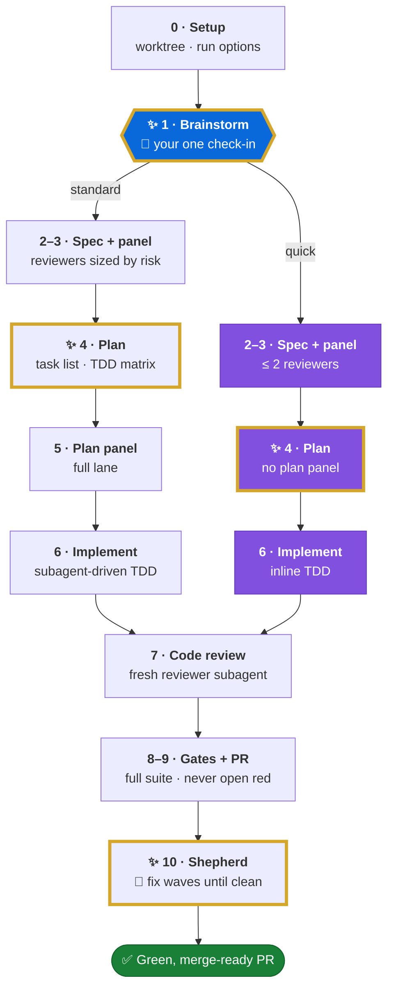

# oneshot-pipeline

**Take a feature or fix from idea to a green, merge-ready pull request in one Claude Code run.**

You approve the design once. After that, the pipeline writes the spec and plan, implements with TDD,
gets independent reviews, opens the PR, and fixes review feedback wave by wave. It stops when CI is
green and no review threads are left open. It never merges for you.

> **Requires [Superpowers](https://github.com/obra/superpowers).** See [Prerequisites](#1-prerequisites).

```text
> execute this as one shot: add rate limiting to the export endpoint
```

## Why use it

- **One check-in.** It asks you about the design once, at the brainstorm step. Expert subagents
  answer the other questions, so the run doesn't wait on you.
- **Review effort follows risk.** Lane triage reads the diff. Auth, persistence, concurrency,
  infra and public-contract changes get the full review panel. Small changes get the lite lane.
- **Every finding needs a failure scenario.** A finding without a concrete scenario is MINOR,
  whatever label the reviewer gave it. You get fewer speculative fixes and fewer review rounds.
- **Different agents write and review.** Specs, plans, code and reviews come from separate
  subagents. The agent that wrote something never reviews it.
- **It costs fewer turns.** CLI helpers replace long polling and discovery loops: wait for CI,
  wait for the review, list threads, resolve them, rerun flaky jobs.
- **It works in any repository.** A repository adapter reads the base branch, CI gates and review
  policy from the target project. Nothing company-specific is built in.

## How it works



<sub>🟦 your only check-in · 🟪 quick mode · 🟩 done · ✨ gold border = runs on <code>fable</code>, or on <code>opus</code> in no-fable mode</sub>

| Phase | What happens |
|---|---|
| 0 Setup | Reads the base branch, CI gates and risks for the repo, then creates a fresh worktree and branch |
| 1 Brainstorm | A design agent drafts questions and options. You approve the design. The lane (full or lite) and the PR size are estimated |
| 2–5 Spec & Plan | Spec and plan are written, then checked by independent reviewer panels. Accepted findings go back to the agent that wrote the document |
| 6 Implement | Subagent-driven development, RED test first, with scoped verification after each step |
| 7–8 Review & gates | Fresh code reviewers, the full local suite, and a lane check against the real diff |
| 9 PR | Rebased once before the first push. It never opens with red checks |
| 10 Shepherd | A fresh `pr-shepherd` agent works through each review wave: verify the claim, fix the class of bug, reply, resolve |
| 11 Done | CI green, zero unresolved threads, and a metrics row is logged for retros |

The full contract lives in [`skills/oneshot-pipeline/SKILL.md`](skills/oneshot-pipeline/SKILL.md),
with one reference file per phase in [`reference/`](skills/oneshot-pipeline/reference/).

### Run options

| Option | Values | Effect |
|---|---|---|
| Mode | `standard` / `quick` | Quick caps the spec panel at two reviewers, skips the plan panel, and implements inline with TDD. Code review still runs in a fresh subagent |
| Model set | `fable` / `no-fable` | No-fable runs the design, plan and wave-fixer roles on `opus` |
| Frontend design | `on` / `off` | Offered only when the request touches UI and [frontend-design](https://github.com/anthropics/claude-plugins-official/tree/main/plugins/frontend-design) is installed. The design agent adds a UI design section (wireframes, states, copy, accessibility floor) that follows the repo's design system and carries through spec, plan and code review |

Name the options when you start a run ("quick one shot", "one shot without fable", "with frontend
design"). If you don't, the pipeline asks once and recommends a choice: risk sets the mode, your
remaining weekly usage sets the model set, and the size of the UI change sets frontend design.

The frontend-design question also offers **Always for this repo** and **Never for this repo**. Those
answers are remembered per repository on your machine, so you aren't asked again there. To reset,
tell the pipeline to forget the frontend-design setting for the repo.

## What's inside

| Path | Contents |
|---|---|
| `skills/oneshot-pipeline/` | The pipeline skill, its phase references, and support scripts |
| `skills/split-large-pr/` | Splits an oversized PR into smaller stacked PRs that can each be tested on their own |
| `agents/pr-shepherd.md` | Fixes one prepared review wave, pushes once, then stops |
| `bin/` | CLI helpers (below), shared library, and tests |
| `link.sh` | Symlinks everything into your Claude Code config |

**CLI helpers:**

| Helper | Purpose |
|---|---|
| `ci-wait` | Blocks until checks settle, or until a configured review check passes |
| `review-wait` | Blocks until the AI reviewer decides on the current head |
| `audit-wait` | Waits for bot audits of threads closed by the author |
| `pr-threads` | Lists every unresolved thread with the code excerpt and related tests, in one call |
| `pr-thread-close` | Replies, resolves, and confirms a thread is closed, in one call |
| `rerun-failed` | Reruns flaky jobs and waits until GitHub stops showing the stale failure |
| `verify-diff` | Scoped tsc, lint and tests for only the files that changed |
| `block-full-suite.sh` | Optional hook that blocks full test-suite runs. Only the controller can override it |

## Quick start

### 1. Prerequisites

> [!IMPORTANT]
> **The oneshot-pipeline skill requires [Superpowers](https://github.com/obra/superpowers).** The
> pipeline's phases call its `brainstorming`, `writing-plans`, `subagent-driven-development` and
> `test-driven-development` skills, and the run cannot finish without them. Install it from the
> official marketplace inside Claude Code:
>
> ```text
> /plugin install superpowers@claude-plugins-official
> ```
>
> If you have your own equivalent skills, you can map them in the repository adapter instead.

- [Claude Code](https://claude.com/claude-code), `git`, `bash`
- [Superpowers](https://github.com/obra/superpowers) (see above)
- [GitHub CLI](https://cli.github.com/) and `jq`, authenticated with `gh auth login` (check with `gh auth status`)
- The target project's dev dependencies and test tools

### 2. Install

```sh
git clone https://github.com/vtrifonov/oneshot-pipeline.git
cd oneshot-pipeline
bash ./link.sh
```

This creates one symlink per item in `~/.claude` (or `$CLAUDE_CONFIG_DIR`), so leave the clone where
it is. Real files are never overwritten: conflicts are reported as `SKIP`. An existing symlink at a
matching path is pointed at this clone, so check those first if you use another config repository.
The script never edits `settings.json`.

Restart Claude Code so it loads the skills and the `pr-shepherd` agent.

### 3. Run

In your target repository, ask Claude Code:

```text
> run the playbook: <describe the feature or fix>
```

Before the first run, decide the target repository's base branch, worktree location, CI gates and
review policy. The pipeline does not assume a checkout layout. Every run needs an independent
correctness/testing review. Full-lane runs also need a security/architecture review. Installed review
skills or freshly briefed reviewer agents can cover both.

### Update

```sh
git pull --ff-only
bash ./link.sh
```

Changes to files that are already linked take effect right away. Rerun `link.sh` to pick up new
items, and restart Claude Code if skills or agents were added.

## Configuration

<details>
<summary><strong>CI and review bot integration</strong></summary>

The PR helpers read `owner/name` from the current checkout or from `--repo`.

| Variable | Used by | Meaning |
|---|---|---|
| `CI_EXCLUDE_CHECKS` | `ci-wait` | Regex for checks that don't gate the PR (by default, every check gates) |
| `CI_REVIEW_CHECK` | `ci-wait` | Regex for a review check that lets `ci-wait` return early. Passing it doesn't mean the PR is approved |
| `AI_REVIEW_BOT` | `review-wait`, `audit-wait` | Login of your AI review bot |
| `AI_REVIEW_JOB` | `review-wait`, `audit-wait` | Regex for the bot's job name, if needed |

`review-wait` and `audit-wait` expect a specific bot protocol. Approval reviews contain
`ai-review:approval reviewed=<sha>`, and audit replies after a thread is closed contain
`ai-review:author-resolve-audit`. No bot identity is built in. With other reviewers, the pipeline
uses the standard GitHub review and check APIs.

</details>

<details>
<summary><strong>Scoped-verification hook</strong></summary>

`block-full-suite.sh` only acts in repositories that have a `.scoped-verification` file at the Git
root. Installing the file doesn't turn it on: registering the hook and using the controller-only
`ALLOW_FULL_SUITE=1` override are covered in
[`reference/distribution.md`](skills/oneshot-pipeline/reference/distribution.md).

</details>

<details>
<summary><strong>Local and private settings</strong></summary>

Logs, metrics, credentials, backups and `repository-adapter.local.md` are gitignored. Project rules
come from the target repository. Keep private details in local configuration, not in the shared skills.
This repository contains no credentials and no private review skills.

</details>

<details>
<summary><strong>Standalone bundle (no repository access)</strong></summary>

To share the pipeline as an archive:

```sh
python3 bin/package-oneshot.py /tmp/oneshot-pipeline.tar.gz
```

The recipient extracts it somewhere permanent and installs:

```sh
tar -xzf oneshot-pipeline.tar.gz
python3 oneshot-pipeline/scripts/install-support.py
```

The installer checks every conflict before it creates any links, and it never replaces unrelated
files. The prerequisites above still apply.

</details>

## Testing

```sh
python3 bin/tests/oneshot-package.test.py
python3 bin/tests/public-portability.test.py
python3 bin/tests/repo-prefs.test.py
bash bin/tests/run.sh
```

The tests use temporary configs and stubbed GitHub responses. They don't touch your real Claude
config or call GitHub.
